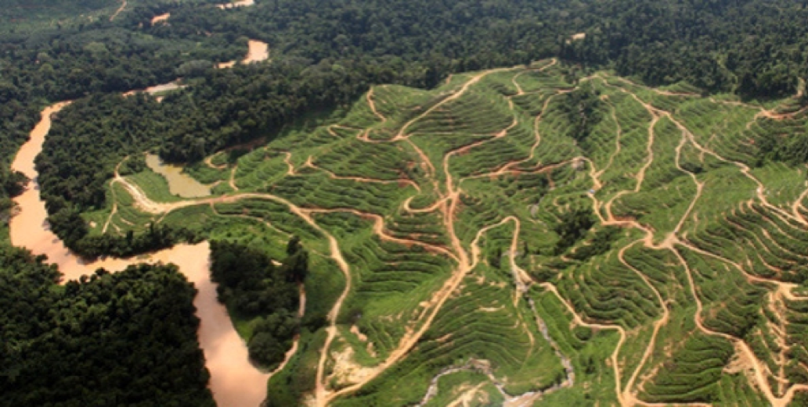

\addtolength{\headheight}{2.0cm} 
\pagestyle{fancyplain} 
\lhead{\includegraphics[height=2cm]{EHA_logo.png}} 
\rhead{\includegraphics[height=2cm]{Horizontal_RGB_600.jpg}} 
\renewcommand{\headrulewidth}{0pt} 


```{r setup, include=FALSE}
knitr::opts_chunk$set(echo = FALSE)
```



##Emerging infectious disease (EID) outbreaks caused by wildlife pathogens are increasing in frequency and economic impact– more than half of the most recent EIDs, including SARS Coronavirus, Ebola, and Zika virus, had a wildlife origin. Nipah Virus alone cost the Malaysian economy around USD$550 million, while Ebola, Avian Influenza and SARS emergence cost the global economy more than USD$50 billion. Human land-use change has been shown to be the number one cause among factors that increase disease emergence. Advancing the knowledge these factors and their impact is essential to develop strategies to reduce and manage the public costs burden of future EIDs.  

##The Infectious Disease Emergence and Economics of Altered landscapes Project (IDEEAL), is a collaboration between EcoHealth Alliance, Universiti Malaysia Sabah, Sabah Wildlife Department, Sabah State Health Department, Ministry of Health Malaysia, Sabah Forestry Department, local NGOs and USAID initiative that investigates how human alteration of landscapes, ecosystem degradation, underlying socio-economic, and ecological factors contribute to disease emergence. Capturing the economic impact of public health risks introduced via land use change supports sustainable land management policies to mitigate these threats. This program builds upon USAID’s investments in pathogen discovery and characterization of disease emergence risk (PREDICT: http://www.vetmed.ucdavis.edu/ohi/predict/). Leveraging existing and new data sets from ongoing pathogen surveillance in animals and people, the program’s economic model estimates potential costs attributable to disease emergence as a function of the location and magnitude of land alterations. These costs—from patient care and treatment, emergency response and containment to travel and trade restrictions, border closures, work stoppages due to disease, reduction in ecosystem services, and negative market shocks— provide valuable information for discussion among governments, the private sector, and civil society to define optimal land use policies. A key strategy in mitigating the threats from diseases of pandemic potential is a robust evidence base that accurately captures the value of ecosystems. This project measures the economic impacts of emerging disease and better quantifies ecosystem services valuations (e.g. disease regulation) to inform reduced impact land use and development policies. 

##The main goals of the IDEEAL project are to (1) develop knowledge about the benefits of conserving forests to regulate diseases (2) estimate the economic benefits and costs of converting land, (3) provide governments, industry, and society with data and tools to make informed land use decisions. 

\newpage

##The IDEEAL project premise is that any land use decision should maximize private and public well-being. Private decisions on land development reduce ecosystem services that benefit the public while creates job opportunities and economic growth to communities. The maximum private and public well-being is achieved choosing each year the optimal amount of land to develop in a determined area given all the benefits and costs. The spatial balance is also achieved by choosing to develop areas where ecosystem services are the lowest and industry’s net benefits are the highest, as well as by conserving areas where ecosystem services are highest while industry’s net benefits yield is the lowest.

##Through including disease regulation as ecosystem services, we quantify the economic costs for humans of developing land for agricultural production. This framework can be used to generate a schedule of land conversion over time to maximize social welfare benefits while accounting for economic private benefits derived from land conversion, public benefits from conservation and health. Our results can be used to inform future land use planning, prioritize areas for conservation as well as to prevent the emergence of infectious diseases linked to deforestation.

##For example, in our model in Sabah Malaysia, we use malaria as an example of infectious disease. In 2014, more than 3,000 cases of malaria were reported in Malaysia, mostly in Sabah and Sarawak. People at most risk are workers in development projects in rural areas such as plantations, mining, road and dam constructions. Studies from Indonesia and Brazil that used empirical data show that an increase of malaria cases was highly correlated with increased deforestation rates. Our results suggest that since 1993, too much land conversion has occurred in Sabah, resulting in public costs for society and reduced profits for the plantations involved in land conversion. The model can be adapted to incorporate data from other diseases, whose transmission has also been linked to deforestation. The total economic loss depends on factoring into the model all diseases linked to land use change. The model takes into account the costs and benefits associated with land development such as clearing land as well as the benefits of leaving intact forests in terms of ecosystem services like water retention and carbon sequestration. The cost of controlling malaria is included as a measure of the loss of an ecosystem service (disease regulation) that comes from land conversion. 

##The economic model determines the economic incentives that might be used as alternatives to minimize the consequences of developing pristine forest for agricultural practices such as palm oil. Although this approach was initially developed with information from agro-businesses, it can be easily extended to other extractive industries like oil exploration. This framework is the first step to develop a local and regional strategy to mitigate emerging pandemics. 

\newpage 

#IDEEAL propose policy recommendations:
## 1. Land use decisions should consider the impact of a proposed land development on humans, animals, and nature well-being. That is, decisions should consider the human-wildlife contact and its implications for infectious disease outbreaks, potential benefits from development, and potential decline in ecosystem services.

## 2. The IDEEAL framework develops a blueprint for policymakers to identify the optimal rate of conversion each year, as well as areas of land that should be protected, areas of land that are suitable for development and areas of land that should be converted back to forest. 

## 3. Improve industry practices and regulations to reduce health-associated costs to society using the findings of the IDEEAL project. For example, determine the optimal payment for violations from mosquito control regulations. Companies who develop land for agriculture purposes, increasing the risk of emerging infectious diseases, should include in their costs of conversion the social costs due to a higher social risk of infectious diseases.
